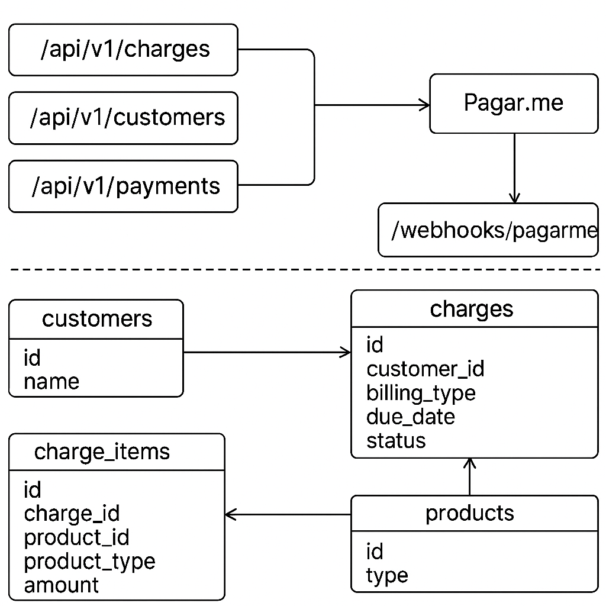

# Plataforma Unificada de Pagamentos

## ✨ Visão Geral

Esta plataforma tem como objetivo centralizar todos os fluxos de cobrança da empresa SaaS em uma solução própria, utilizando exclusivamente o gateway Pagar.me. Com isso, pretendemos unificar cobranças de produtos distintos (PMS, Motor de Reservas, Channel Manager), oferecer suporte a diferentes modelos de cobrança (avulsa e recorrente) e preparar o sistema para escalabilidade futura.

---

## 🔄 Arquitetura Geral

* API RESTful versionada (`/api/v1/...`)
* Domínios principais:

  * `Customer`, `Charge`, `ChargeItem`, `Product`
* Gateway de pagamento: Pagar.me
* Webhooks para atualização de status

---

## 🔗 Endpoints da API

### Charges

```
POST /api/v1/charges
GET  /api/v1/charges/:id
```

### Customers

```
POST /api/v1/customers
```

### Payments

```
POST /api/v1/payments
```

### Webhooks

```
POST /api/v1/webhooks/pagarme
```

---

## 🔄 Exemplo de Payload (criação de cobrança)

```json
{
  "customer_id": "cus_123",
  "products": [
    {
      "product_type": "PMS",
      "product_id": 1,
      "amount": 20000
    },
    {
      "product_type": "Motor",
      "product_id": 2,
      "amount": 5000
    }
  ],
  "billing_type": "recurring",
  "due_date": "2025-08-05"
}
```

---

## 📚 Modelagem dos Domínios (Rails)

### Customer

```ruby
class Customer < ApplicationRecord
  has_many :charges
end
```

### Charge

```ruby
class Charge < ApplicationRecord
  belongs_to :customer
  has_many :charge_items

  enum billing_type: { one_time: 0, recurring: 1 }
  enum status: { pending: 0, paid: 1, failed: 2 }

  def total_amount
    charge_items.sum(:amount)
  end
end
```

### ChargeItem

```ruby
class ChargeItem < ApplicationRecord
  belongs_to :charge
  belongs_to :product, polymorphic: true
end
```

### Product

```ruby
class Product < ApplicationRecord
  # Polimórfico (PMS, Motor, Channel)
end
```

---

## 📼 Integração com Pagar.me (simulação)

```ruby
class PagarmeGateway
  def initialize(api_key:)
    @api_key = api_key
  end

  def create_charge(charge)
    puts "POST /transactions with charge #{charge.id}"
    {
      pagarme_id: "pgm_123",
      status: "waiting_payment"
    }
  end
end
```

---

## 📚 Estratégia de Migração ASAAS → Pagar.me

1. Marcar clientes ASAAS com `legacy_provider: :asaas`
2. Importar histórico de cobranças para rastreabilidade
3. Criar clientes no Pagar.me
4. Ativar modo dual-gateway durante a transição
5. Log de migração por cliente

```ruby
Customer.create(name: "Hotel Bela Vista", legacy_provider: :asaas)
```

---

## 🔹 Escalabilidade e Integração com PMS

* Produtos usam a API para criar cobranças e consultar status
* Webhooks da plataforma notificam mudança de status
* Cada produto referencia cobranças através de `charge_items`

---

## ✨ Bônus

### Múltiplos produtos por fatura

Permitido via `ChargeItem`, que aceita múltiplos produtos polimórficos:

```ruby
charge.charge_items << ChargeItem.new(product: pms, amount: 10000)
charge.charge_items << ChargeItem.new(product: channel, amount: 5000)
```

### Versionamento de API

Organização por namespace:

```
app/controllers/api/v1/charges_controller.rb
```

Permite evoluir para `/v2` sem quebra de contratos.

### Tornar um produto independente

* Transformar em engine ou serviço externo
* Permitir uso por outros sistemas SaaS internos ou externos
* Prepara para monetização da solução como produto

---

## 👤 Autor

Tech Lead: Erisson Peixoto

---

## 🎨 Diagrama ERD + Fluxo



